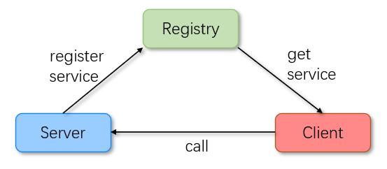

# MyRPC

MyRPC是一个基于`Netty + Kryo + Zookeeper + Spring`实现的RPC框架。欢迎大家star\fork本项目，也欢迎大家批评指正并且提交PR。

MyRPC的架构如下图所示：

下面是实现以及待实现功能列表

## 功能列表

- [x] 使用Netty实现网络传输
- [x] 使用JDK的动态代理
- [x] 使用Kryo序列化机制
- [x] 使用Zookeeper作为注册中心，管理已注册服务的地址信息 
- [x] 通过Spring扫描注解，然后注册到Zookeeper
- [x] 增加服务版本号和组ID，处理服务的升级和处理一个接口有多个实现类的情况
- [x] 负载均衡功能的实现
  - [x] 随机负载均衡策略
  - [ ] 更多负载均衡策略
- [ ] 客户端与服务端通信协议重新设计
- [ ] 实现服务的监控列表（类似dubbo-admin）
- [ ] 压缩传输消息
- [ ] 增加可配置比如序列化、注册中心的实现方式 

## 运行项目
代办...

## 参考资料
1. 深入理解RPC框架原理与实现
2. [guide-rpc-framework](https://github.com/Snailclimb/guide-rpc-framework)